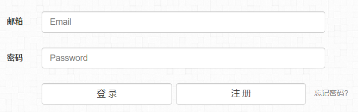

## 食用方法
```
SWebCracker.exe	显示使用说明
SWebCracker.exe -h 使用帮助

SWebCracker.exe  -u -n -p -s [-h][-e][-head][-nf|-un][-pf|-pw][-se][-rs][-rt][-ru][-t][-ot][-o]

```

## 食用演示
url : https://shigophilo.github.io/login.html



+ 用户名输入框
```
<input name="email" id="email" type="email" class="form-control" placeholder="Email">
```
+ 密码输入框
```
<input name="pass" id="pass" type="password" class="form-control" placeholder="Password">
```
+ 登录按钮
```
<input id="login" type="button" class="btn btn-default" value="登 录" onclick="return check_login();">
```
### 简单食用
+ 使用指定的账号:admin 和密码:123456 爆破
```
SWebCracker.exe -u https://shigophilo.github.io/login.html -n email -p pass -s login -un admin -pw 123456
```
+ 使用 指定账号:admin和密码字典pass.txt破解
```
SWebCracker.exe -u https://shigophilo.github.io/login.html -n email -p pass -s login -un admin -pf pass.txt
```
+ 使用账号字典:user.txt 和密码字典:pass.txt破解
```
SWebCracker.exe -u https://shigophilo.github.io/login.html -n email -p pass -s login -uf user.txt -pf pass.txt
```
### 复杂食用
** 可以通过匹配url,title和页面文字内容来确定**

+ 匹配页面返回内容
如果页面中返回了"登录成功",则表示匹配成功
```
SWebCracker.exe -u https://shigophilo.github.io/login.html -n email -p pass -s login -uf user.txt -pf pass.txt -rs "登录成功"
```
+ 匹配网页title
如:`login.html`页面的title是"登录页面", 数据包提交到`login.php`,logon.php页面的title为"登录中"
```
SWebCracker.exe -u https://shigophilo.github.io/login.html -n email -p pass -s login -uf user.txt -pf pass.txt -rt "登录中"
```
+ 匹配url
如:登录页面的url为:https://shigophilo.github.io/login.html  数据包提交到其它页面
```
SWebCracker.exe -u https://shigophilo.github.io/login.html -n email -p pass -s login -uf user.txt -pf pass.txt -ru https://shigophilo.github.io/login.html
```
## 计划
增加验证码提交

## 不足
需要1010端口没被占用(很抱歉,端口写死了)

当前目录下要有chromedriver.exe(很抱歉,也写死了)